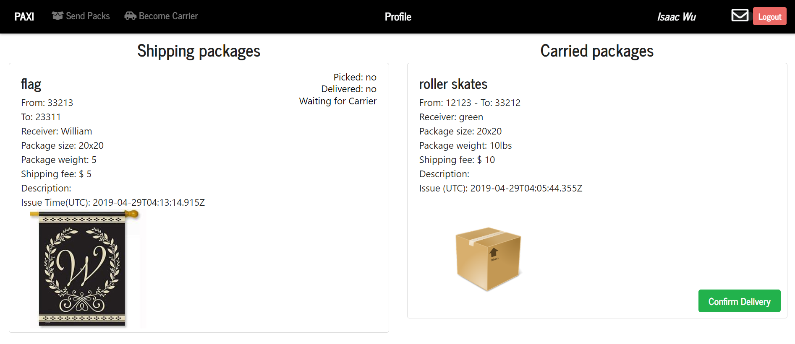
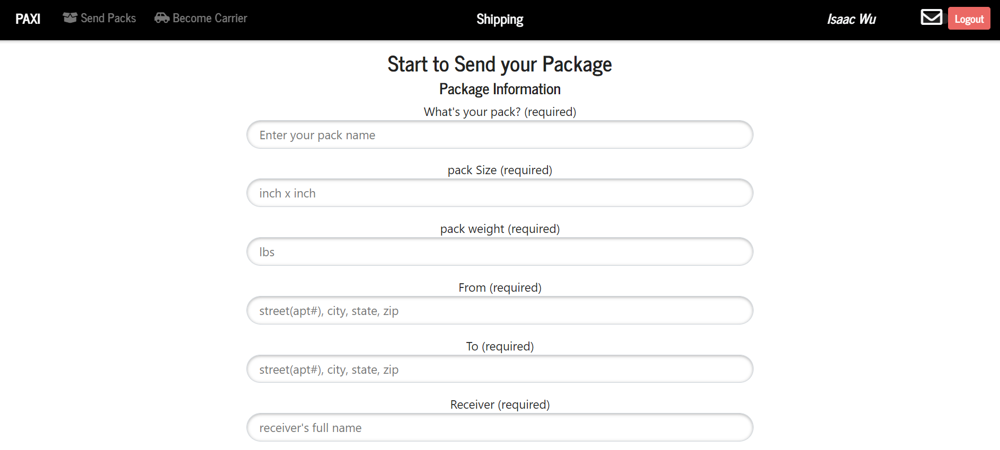
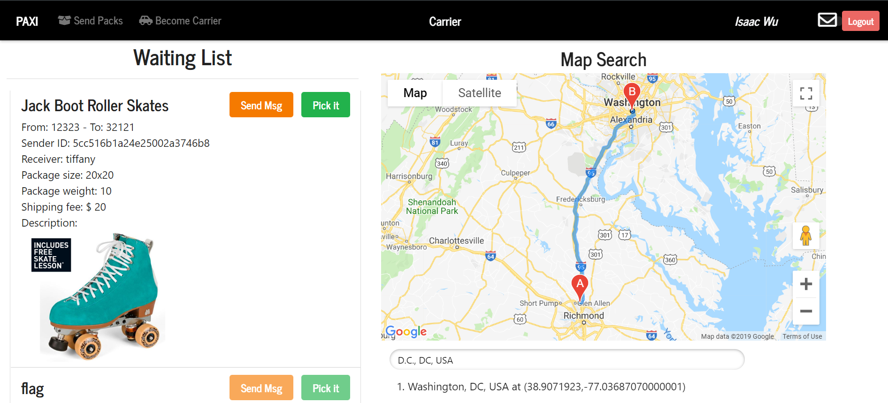
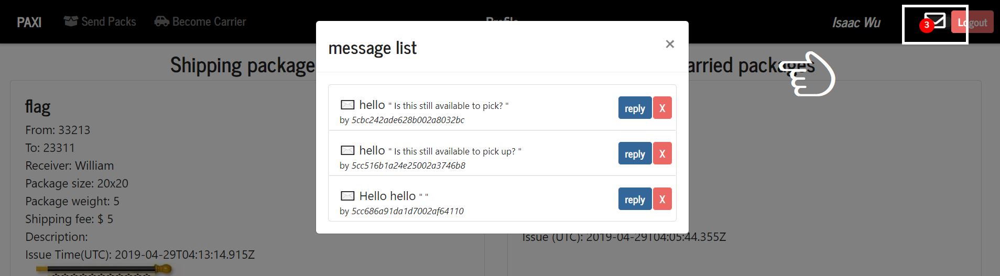
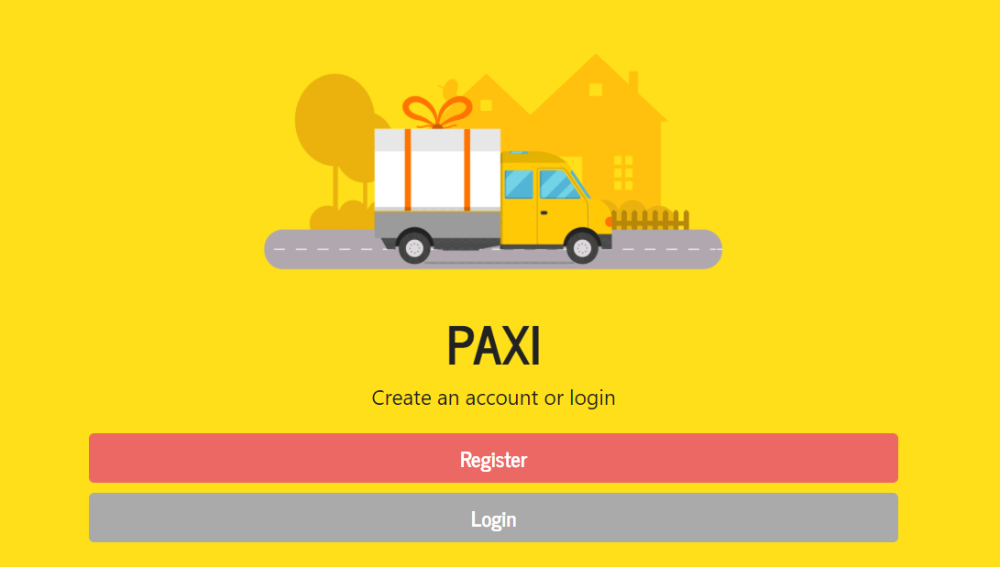
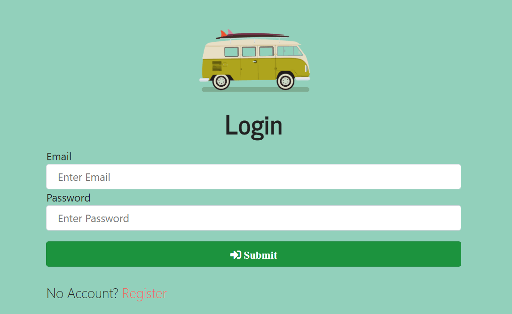

# 📦 PAXI

#### PAXI allows users to post items/packages that they need delivered quicker than the post-office/UPS/Fed-Ex may be able to offer.  PAXI connects the shipper and the driver to complete the shipment. 

#### 🚛Technologies
- [x] MongoDB Mongoose
- [x] Node Express
- [x] React
- [x] Google Map API
- [x] JavaScript/JQuery
- [x] CSS/Bootstrap

#### 🚛 Local Install

* `git clone` or download from github
* `npm i` in root, install npm packages
* `npm start` to start node server and react server
* open browser and load http://localhost:3000/

#### 📬 Author
Isaac Wu,

Abdullah Alamri,

James Lamb
<!-- * [Isaac Wu](https://github.com/squall2046)
* [App demo](https://googlebooks-iw.herokuapp.com/) -->

## Copyright
© 2019 All Rights Reserved
